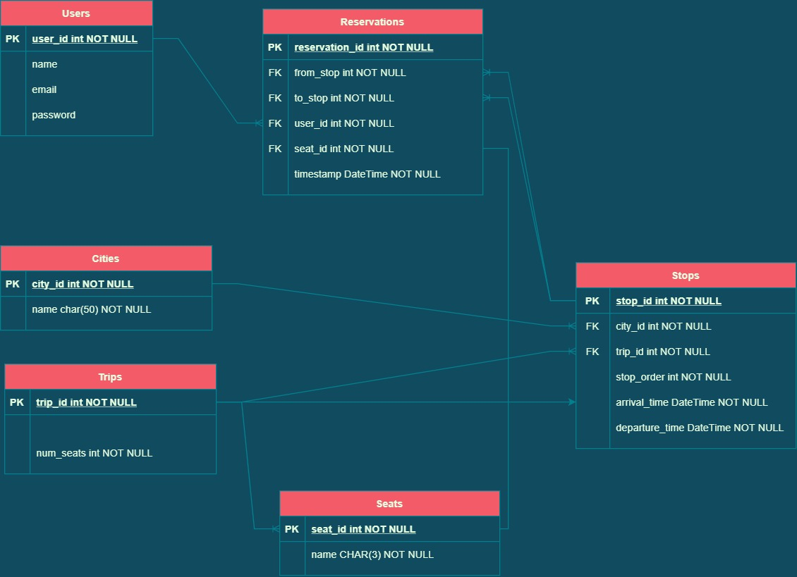

# Fleet-MS

Fleet-MS is a fleet management for bus trips booking service build by Laravel PHP.

Fleet-MS provides the following functionalities

- User registeration and authentication.
- َQuery list of cities/stations.
- Search for trips going from certain city to a destination city.
- Check available seats for a certain trip.
- Book a seat on the desired trip.

---
## Development Tools
* Laravel v9.4.1
* PHP v8.1.3
* MySQL v8.0.28

---
## Installation
1. Clone this repo
2. Create the .env file from the .env.example file

	```shell
	$ cp .env.example .env
	```

3. Build the docker image

	```shell
	$ docker-compose build app
	```
3. Run the docker image

   ```shell
   $ docker-compose up -d
   ```
4. Install the application dependencies
   
   ```shell
   $ docker-compose exec app composer install
   ```

5. Run the migrations and seed the database with initial data

   ```shell
   $ docker-compose exec app php artisan migrate:refresh --seed
   ```

You're now ready to start using the APIs. Verify that the APIs are working by visiting the following path:

`http://localhost:8000/api/cities`

---
## APIs Documentation
Fleet-MS is designed as a REST APIs which provides resources in `JSON` format by default.

The user should supply the `Accept` header with `application/json` value to all requests.

You can access the APIs documentation [here](https://documenter.getpostman.com/view/6099942/UVsJvRyF).

You can also easily test the APIs through this [postman collection](https://www.postman.com/mo2men1/workspace/fleetms-workspace/collection/6099942-596b0a9b-f5d7-4426-8897-c1304ea61e4b?action=share&creator=6099942).

[](https://app.getpostman.com/run-collection/6099942-596b0a9b-f5d7-4426-8897-c1304ea61e4b?action=collection%2Ffork&collection-url=entityId%3D6099942-596b0a9b-f5d7-4426-8897-c1304ea61e4b%26entityType%3Dcollection%26workspaceId%3Da96af49d-fa39-4669-9a57-eefb322fb866)

**Note: You'll need to have postman installed locally to be able to run the collection.**

---
## System Design
### Entity Relationship Diagram


---
## Operation
Fleet-MS allows users to query trips from a start city to destination city and check available seats in such trips.

Seat availability is checked such that the seat must be available from the start point to the end point of the trip.


Suppose we have a bus trip that travels from city `A` to city `E`.

A user is trying to reserve a booking on that trip from city `B` to city `D`.

The user won't be able to reserve the selected seat if it was already reserved

* with destination city after `B`
* and with source city before `D`

---
## Authentication
Fleet-MS supports multiple authentication techniques to support different consumer types by providing session cookies or Bearer tokens.

In order to use session cookies, the user should use the `login` API

`api/login`

If a token is needed instead of the session cookies, the following API should be user

`api/token`

In such case, an addition parameter `device_name` should be supplied to associate the generated token to the user's device.

---
## Future Work
* Add administration panel to manage entities and add trip details.
* Implement Unit tests.
* Allow Users to reserve multiple seats in a single reservation.
* Support filtering trips by date or time.
* Support search for the nearest trips to the destination city based on user's location.

---
## Limitations
* No administration panel to register new trips.
* No endpoint to cancel a reservation.
  